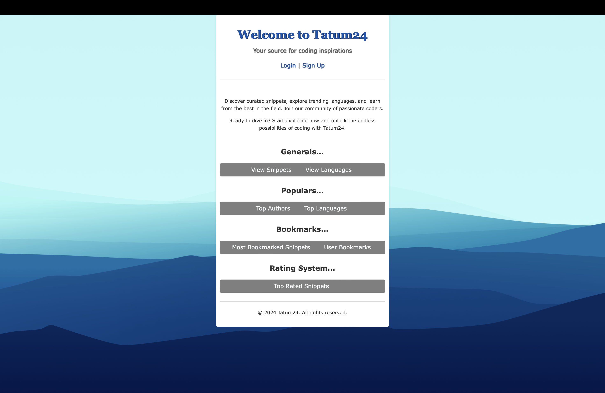

Le informazioni relative al progetto sono reperibili all'interno del file [elaborato_MICHELINI](elaborato_MICHELINI.pdf)

Comandi per gestire i requisiti del progetto: 

Da linea di comando eseguire:
```sh
git clone https://github.com/zChups/tatum24.git
cd tatum24/
```
Eseguire l'accesso al virtual environment con il comando (previa installazione del comando pipenv):
```sh
pipenv shell
```
Installare i requisiti fondamentali del progetto attraverso il comando:
```sh
pip3 install -r requirements.txt
```

Per avviare il server eseguire il comando: 
```sh
python3 manage.py runserver
```
Il server sarà accessibile dall'url: **http://127.0.0.1:8000**



